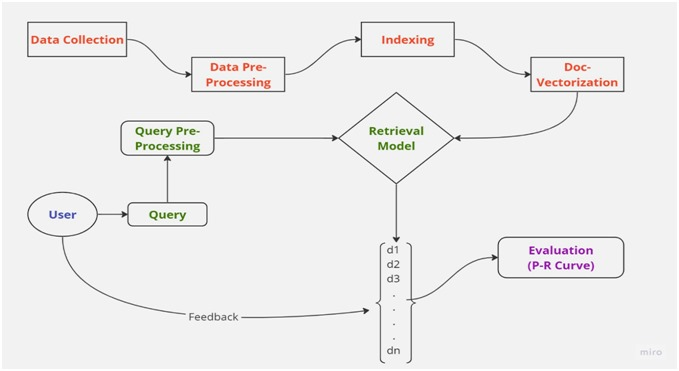

<h1 align="center">Techno Tales</h1>
<h3 align="center">Search Engine for News Document Retrieval - Tech News</h3>
<h3 align="center">The goal of this project is to create a search engine tailored for retrieving technology news articles</h3>

<h2 align="left">Tech Stack and Tools :</h2>
<h3 align="right">Logo Design</h3>


<p align="left">
<a href="https://www.python.org" target="_blank" rel="noreferrer">  </a>
<a href="https://flask.palletsprojects.com/en/stable/" target="_blank" rel="noreferrer">  </a>
<a href="https://pypi.org/project/beautifulsoup4/" target="_blank" rel="noreferrer">  </a>
<a href="https://reactjs.org/" target="_blank" rel="noreferrer">  </a>
<a href="https://tailwindcss.com/" target="_blank" rel="noreferrer">  </a>
</p>

<h2 align="left">Work Flow</h2>


<h3 align="left">Data Collection</h3>

- **Links Collection from tech-crunch** : All the articles released on a particular date are arranged under the URL which looks link **https://www.techcrunch.com/dd-mm-yyyy/**.
We sent request to this link by iterating the date from June 6th 2005 to November 25th 2023.

- **Source Website** : https://www.techcrunch.com

- **Fetching Data from links** : After collecting all the links, iteratively requests were sent to every link and parsed the response using beautiful-Soup library.

<h3 align="left">Data Pre-Processing</h3>

- **Text Cleaning** : Clean the text data to remove unnecessary characters and formatting.

-  **Text Cleaning** : Break the text into individual tokens (words or phrases).

-  **Lemmatization** : Convert words to their base or root form.

-  **Stop Word Removal** : Eliminate common words that do not contribute significant meaning (e.g., "and," "the").

<h3 align="left">Indexing</h3>

- An efficient indexing system to facilitate quick retrieval of documents.

<h3 align="left">Ranking</h3>

- Utilize the Vector Space Model to represent documents and queries as vectors.

- Rank documents based on their relevance to the user’s query.

<h3 align="left">Search Engine Implementation</h3>

- **User Input:** : Capture user queries for searching using frontend application.

-  **Query Processing** : Process the input query to prepare it for matching against indexed documents.

-  **Cosine Similarity** : Calculate cosine similarity between document vectors and query vectors to determine relevance.

<h3 align="left">User Interface</h3>

- Developed a user-friendly interface for seamless interaction with the search engine.

<h3 align="left">Feedback Mechanism</h3>

- Implemented a system to collect user feedback on retrieved results.

<h3 align="left">Evaluation</h3>

- Analyze performance using Precision-Recall (P-R) curve after marking retrieved documents as relevant or non-relevant.


<h2 align="left">Installation</h2>
<h3>To get started with this project, clone the repository and install the necessary libraries in your system</h3>

```bash
# Clone the repository
git clone https://github.com/Rupesh2728/Tom-and-Jerry-Free-Fall-Frenzy---Multimedia-Systems.git

# Navigate to the project directory
cd Tom-and-Jerry-Free-Fall-Frenzy---Multimedia-Systems-main

# Run the code
python Main.py
```


<h2 align="left">Game Images</h2>
<a href="" target="_blank" rel="noreferrer"> 
 
</a>

<a href="" target="_blank" rel="noreferrer"> 
 
</a>

<a href="" target="_blank" rel="noreferrer"> 
 
</a>


<h2 align="left">Contact Me</h2>

- 📫 You can to reach me by mailing to **rupesh.p21@iiits.in** or **rupeshprofessional2728@gmail.com**

- 👨‍💻 Project is available at [https://github.com/Rupesh2728/Tom-and-Jerry-Free-Fall-Frenzy---Multimedia-Systems.git]
  


